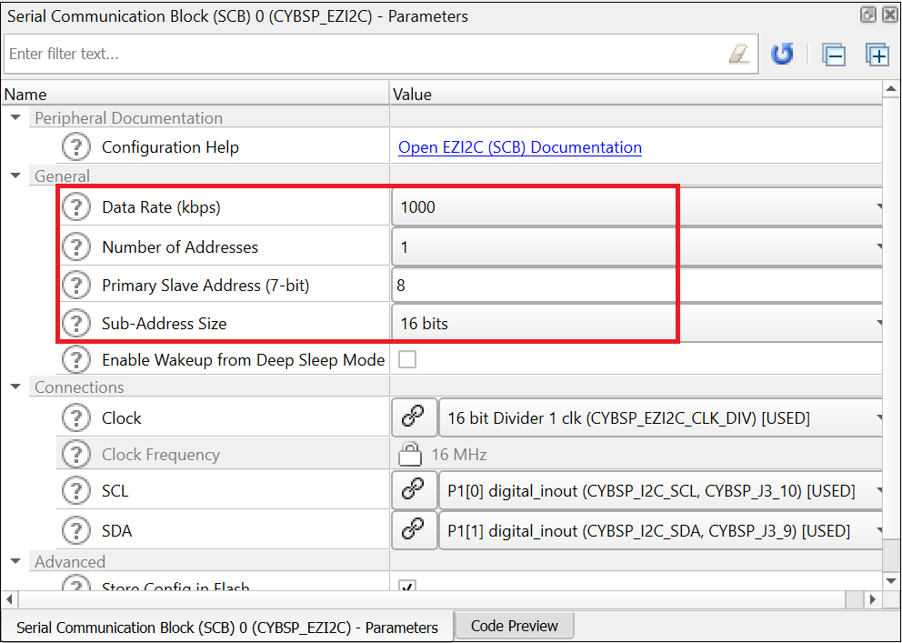

# PSoC&trade; 4 MCU: MSC self-capacitance touchpad tuning

This code example demonstrates how to use the CAPSENSE&trade; middleware to detect a finger touch position on a self-capacitance-based touchpad widget in PSoC&trade; 4 devices with multi sense converter (MSC).

In addition, this code example also explains how to manually tune the self-capacitance-based touchpad for optimum performance with respect to parameters such as reliability, power consumption, response time, and linearity using the CSD-RM sensing technique and CAPSENSE&trade; tuner GUI. Here, CAPSENSE&trade; sigma-delta (CSD) represents the self-capacitance sensing technique and RM represents the ratiometric method.

[View this README on GitHub.](https://github.com/Infineon/mtb-example-psoc4-msc-capsense-csd-touchpad-tuning)

[Provide feedback on this code example.](https://cypress.co1.qualtrics.com/jfe/form/SV_1NTns53sK2yiljn?Q_EED=eyJVbmlxdWUgRG9jIElkIjoiQ0UyMzIyNzMiLCJTcGVjIE51bWJlciI6IjAwMi0zMjI3MyIsIkRvYyBUaXRsZSI6IlBTb0MmdHJhZGU7IDQgTUNVOiBNU0Mgc2VsZi1jYXBhY2l0YW5jZSB0b3VjaHBhZCB0dW5pbmciLCJyaWQiOiJzYWhnIiwiRG9jIHZlcnNpb24iOiIzLjAuMCIsIkRvYyBMYW5ndWFnZSI6IkVuZ2xpc2giLCJEb2MgRGl2aXNpb24iOiJNQ0QiLCJEb2MgQlUiOiJJQ1ciLCJEb2MgRmFtaWx5IjoiUFNPQyJ9)

## Requirements

- [ModusToolbox&trade; software](https://www.infineon.com/modustoolbox) v3.1 or later (tested with v3.1)
- Board support package (BSP) minimum required version: 3.0.0
- Programming language: C
- Associated parts: [PSoC&trade; 4100S Max](https://www.infineon.com/cms/en/product/microcontroller/32-bit-psoc-arm-cortex-microcontroller/psoc-4-32-bit-arm-cortex-m0-mcu/psoc-4100/)

## Supported toolchains (make variable 'TOOLCHAIN')

- GNU Arm&reg; embedded compiler v11.3.1 (`GCC_ARM`) - Default value of `TOOLCHAIN`
- Arm&reg; compiler v6.16 (`ARM`)
- IAR C/C++ compiler v9.30.1 (`IAR`)


## Supported kits (make variable 'TARGET')

- [PSoC&trade; 4100S Max Pioneer Kit](https://www.infineon.com/CY8CKIT-041S-MAX) (`CY8CKIT-041S-MAX`) - Default value of `TARGET`


## Hardware setup

This example uses the board's default configuration. See the [kit user guide](https://www.infineon.com/dgdl/Infineon-CY8CKIT-041S-MAX_PSoC_4100S_Max_Pioneer_Kit_Guide-UserManual-v01_00-EN.pdf?fileId=8ac78c8c7d710014017d71538d1f209d) to ensure that the board is configured correctly to V<sub>DDA</sub> at 5 V (J10 should be at positions 1 and 2). If you are using the code example at a V<sub>DDA</sub> voltage other than 5 V, ensure to set up the device power voltages correctly for the proper operation of the device power domains.  See the "Steps to set up the V<sub>DDA</sub> supply voltage in Device Configurator" section in this code example for more details.


## Software setup

This example requires no additional software or tools.


## Using the code example

Create the project and open it using one of the following:

<details><summary><b>In Eclipse IDE for ModusToolbox&trade; software</b></summary>

1. Click the **New Application** link in the **Quick Panel** (or, use **File** > **New** > **ModusToolbox&trade; Application**). This launches the [Project Creator](https://www.infineon.com/ModusToolboxProjectCreator) tool.

2. Pick a kit supported by the code example from the list shown in the **Project Creator - Choose Board Support Package (BSP)** dialog.

   When you select a supported kit, the example is reconfigured automatically to work with the kit. To work with a different supported kit later, use the [Library Manager](https://www.infineon.com/ModusToolboxLibraryManager) to choose the BSP for the supported kit. You can use the Library Manager to select or update the BSP and firmware libraries used in this application. To access the Library Manager, click the link from the **Quick Panel**.

   You can also just start the application creation process again and select a different kit.

   If you want to use the application for a kit not listed here, you may need to update the source files. If the kit does not have the required resources, the application may not work.

3. In the **Project Creator - Select Application** dialog, choose the example by enabling the checkbox.

4. (Optional) Change the suggested **New Application Name**.

5. The **Application(s) Root Path** defaults to the Eclipse workspace which is usually the desired location for the application. If you want to store the application in a different location, you can change the *Application(s) Root Path* value. Applications that share libraries should be in the same root path.

6. Click **Create** to complete the application creation process.

For more details, see the [Eclipse IDE for ModusToolbox&trade; software user guide](https://www.infineon.com/MTBEclipseIDEUserGuide) (locally available at *{ModusToolbox&trade; software install directory}/docs_{version}/mt_ide_user_guide.pdf*).

</details>

<details><summary><b>In command-line interface (CLI)</b></summary>

ModusToolbox&trade; software provides the Project Creator as both a GUI tool and the command line tool, "project-creator-cli". The CLI tool can be used to create applications from a CLI terminal or from within batch files or shell scripts. This tool is available in the *{ModusToolbox&trade; software install directory}/tools_{version}/project-creator/* directory.

Use a CLI terminal to invoke the "project-creator-cli" tool. On Windows, use the command line "modus-shell" program provided in the ModusToolbox&trade; software installation instead of a standard Windows command-line application. This shell provides access to all ModusToolbox&trade; software tools. You can access it by typing `modus-shell` in the search box in the Windows menu. In Linux and macOS, you can use any terminal application.

The "project-creator-cli" tool has the following arguments:

Argument | Description | Required/optional
---------|-------------|-----------
`--board-id` | Defined in the `<id>` field of the [BSP](https://github.com/Infineon?q=bsp-manifest&type=&language=&sort=) manifest | Required
`--app-id`   | Defined in the `<id>` field of the [CE](https://github.com/Infineon?q=ce-manifest&type=&language=&sort=) manifest | Required
`--target-dir`| Specify the directory in which the application is to be created if you prefer not to use the default current working directory | Optional
`--user-app-name`| Specify the name of the application if you prefer to have a name other than the example's default name | Optional

<br />

The following example clones the "[PSoC&trade; 4: MSC self-capacitance touchpad tuning](https://github.com/Infineon/mtb-example-psoc4-msc-capsense-csd-touchpad-tuning)" application with the desired name "CSDTouchpadTuning" configured for the *CY8CKIT-041S-MAX* BSP into the specified working directory, *C:/mtb_projects*:

   ```
   project-creator-cli --board-id CY8CKIT-041S-MAX --app-id mtb-example-psoc4-msc-capsense-csd-touchpad-tuning --user-app-name CSDTouchpadTuning --target-dir "C:/mtb_projects"
   ```

**Note:** The project-creator-cli tool uses the `git clone` and `make getlibs` commands to fetch the repository and import the required libraries. For details, see the "Project creator tools" section of the [ModusToolbox&trade; software user guide](https://www.infineon.com/ModusToolboxUserGuide) (locally available at *{ModusToolbox&trade; software install directory}/docs_{version}/mtb_user_guide.pdf*).

To work with a different supported kit later, use the [Library Manager](https://www.infineon.com/ModusToolboxLibraryManager) to choose the BSP for the supported kit. You can invoke the Library Manager GUI tool from the terminal using `make library-manager` command or use the Library Manager CLI tool "library-manager-cli" to change the BSP.

The "library-manager-cli" tool has the following arguments:

Argument | Description | Required/optional
---------|-------------|-----------
`--add-bsp-name` | Name of the BSP that should be added to the application | Required
`--set-active-bsp` | Name of the BSP that should be as active BSP for the application | Required
`--add-bsp-version`| Specify the version of the BSP that should be added to the application if you do not wish to use the latest from manifest | Optional
`--add-bsp-location`| Specify the location of the BSP (local/shared) if you prefer to add the BSP in a shared path | Optional

<br />

Following example adds the CY8CKIT-041S-MAX BSP to the already created application and makes it the active BSP for the app:

   ```
   ~/ModusToolbox/tools_{version}/library-manager/library-manager-cli --project "C:/mtb_projects/CSDTouchpadTuning" --add-bsp-name CY8CKIT-041S-MAX --add-bsp-version "latest-v4.X" --add-bsp-location "local"

   ~/ModusToolbox/tools_{version}/library-manager/library-manager-cli --project "C:/mtb_projects/CSDTouchpadTuning" --set-active-bsp APP_CY8CKIT-041S-MAX
   ```

</details>

<details><summary><b>In third-party IDEs</b></summary>

Use one of the following options:

- **Use the standalone [Project Creator](https://www.infineon.com/ModusToolboxProjectCreator) tool:**

   1. Launch Project Creator from the Windows Start menu or from *{ModusToolbox&trade; software install directory}/tools_{version}/project-creator/project-creator.exe*.

   2. In the initial **Choose Board Support Package** screen, select the BSP, and click **Next**.

   3. In the **Select Application** screen, select the appropriate IDE from the **Target IDE** drop-down menu.

   4. Click **Create** and follow the instructions printed in the bottom pane to import or open the exported project in the respective IDE.

<br />

- **Use command-line interface (CLI):**

   1. Follow the instructions from the **In command-line interface (CLI)** section to create the application.

   2. Export the application to a supported IDE using the `make <ide>` command.

   3. Follow the instructions displayed in the terminal to create or import the application as an IDE project.

For a list of supported IDEs and more details, see the "Exporting to IDEs" section of the [ModusToolbox&trade; software user guide](https://www.infineon.com/ModusToolboxUserGuide) (locally available at *{ModusToolbox&trade; software install directory}/docs_{version}/mtb_user_guide.pdf*).

</details>


## Operation

1. Connect the FFC cable between J9 on the PSoC&trade; 4100S Max Pioneer Board and J2 on the capacitive sensing expansion board. Connect a USB 2.0 Type-A to Micro-B cable on J8 (USB Micro-B connector) as shown in **Figure 1** to power the device. 
      
   **Figure 1. Connecting the CY8CKIT-041S-MAX kit with a capacitive sensing expansion board to a PC**

   

2. Program the board using one of the following:

   <details><summary><b>Using Eclipse IDE for ModusToolbox&trade; software</b></summary>

      1. Select the application project in the Project Explorer.

      2. In the **Quick Panel**, scroll down, and click **\<Application Name> Program (KitProg3_MiniProg4)**.
   </details>

   <details><summary><b>Using CLI</b></summary>

     From the terminal, execute the `make program` command to build and program the application using the default toolchain to the default target. The default toolchain is specified in the application's Makefile but you can override this value manually:
      ```
      make program TOOLCHAIN=<toolchain>
      ```

      Example:
      ```
      make program TOOLCHAIN=GCC_ARM
      ```
   </details>

3. After programming, the application starts automatically.

4. To test the application, slide your finger over the CAPSENSE&trade; touchpad and observe that the user LED turns ON when touched and turns OFF when the finger is lifted.

5. You can also monitor the CAPSENSE&trade; data using the CAPSENSE&trade; tuner application as follows:

### Monitor data using the CAPSENSE&trade; tuner

1. Open the CAPSENSE&trade; tuner from the **Tools** section in the IDE Quick Panel. 
    
   You can also run the CAPSENSE&trade; tuner application standalone from *{ModusToolbox&trade; software install directory}/ModusToolbox/tools_{version}/capsense-configurator/capsense-tuner*. In this case, after opening the application; select **File** > **Open** and open the *design.cycapsense* file of the respective application, which is in the *{Application root directory}/bsps/TARGET_\<BSP-NAME>/config* folder. 

   See the [ModusToolbox&trade; software user guide](https://www.infineon.com/ModusToolboxUserGuide) (locally available at *{ModusToolbox&trade; install directory}/docs_{version}/mtb_user_guide.pdf*) for options to open the CAPSENSE&trade; tuner application using the CLI.

2. Ensure that the kit is in CMSIS-DAP bulk mode (KitProg3 status LED is ON and not blinking). See [Firmware-loader](https://github.com/Infineon/Firmware-loader) to learn how to update the firmware and switch modes in KitProg3.
  
3. In the tuner application, click the **Tuner Communication Setup** or select **Tools** > **Tuner Communication Setup** and select the I2C checkbox under KitProg3 and configure the parameters as follows: 

    - **I2C address: 8**
    - **Sub-address: 2-Bytes**
    - **Speed (kHz): 1000**

    These are the same values set in the EZI2C resource.

   **Figure 2. Tuner communication setup parameters**

     

4. Click **Connect** or select **Communication** > **Connect** to establish a connection.

5. Click **Start** or select **Communication** > **Start** to start data streaming from the device. 
   
    The tuner displays the data from the sensor in the **Widget View**, **Graph View**, and **Touchpad View** tabs. 

6. Set the **Read Mode** to synchronized mode. Under the **Widget View** tab, you can see the touchpad widget highlighted in blue color when you touch it. 

   **Figure 3. Widget view of the CAPSENSE&trade; tuner**

    

7. You can view the raw count, baseline, difference count, status for each sensor, and touchpad position in the **Graph View** tab. For example, to view the sensor data for touchpad 0, select **Touchpad0_Col0** under **Touchpad0**.

    **Figure 4. Graph view of the CAPSENSE&trade; tuner**

    

8. The **Touchpad View** tab shows the heatmap view; it visualizes finger movement.

   **Figure 5. Touchpad view of the CAPSENSE&trade; tuner**

   

9. Observe the **Widget/Sensor Parameters** section in the **CAPSENSE&trade; Tuner** window. **Figure 5** shows the compensation CDAC values for each touchpad sensor element calculated by the CAPSENSE&trade; resource. 
      
10. Verify that the SNR is greater than 5:1 by following the steps given in **Stage 4** starting with **Step 6**.
   
    Non-reporting of false touches and the linearity of the position graph indicate proper tuning.
   
   **Note:** The touchpad performance can be further enhanced by configuring the board to connect the hatch pattern to the shield. To do so, see the kit user guide for the board connection settings. Ensure that you enable the shield signals in the CAPSENSE&trade; configurator as shown in **Figure 6**. Then, retune the touchpad following the tuning process explained in [Tuning procedure](#tuning-procedure).

   **Figure 6. Enabling shield signals in CAPSENSE&trade; configurator**

   

## Tuning procedure

<details><summary><b> Create custom BSP for your board </b></summary>

1. Create a custom BSP for your board having any device, by following the steps given in [KBA231373](https://community.infineon.com/t5/Knowledge-Base-Articles/ModusToolbox-2-2-and-later-Make-a-Custom-BSP-KBA231373/ta-p/251107). In this code example, it was created for the device “CY8C4149AZI-S598”.

2. Open the *design.modus* file from *{Application root directory}/bsps/TARGET_\<BSP-NAME>/config* folder obtained in the previous step and enable CAPSENSE&trade; to get the *design.cycapsense* file. CAPSENSE&trade; configuration can then be started from scratch as explained below.

</details>

The following steps explain the tuning procedure.

**Note:** See the section "Selecting CAPSENSE&trade; hardware parameters" in the [AN85951 – PSoC&trade; 4 and PSoC&trade; 6 MCU CAPSENSE&trade; design guide](https://www.infineon.com/AN85951) to learn about the considerations for selecting each parameter value.

**Figure 7. CSD touchpad widget tuning flow**  


Do the following to tune the touchpad:

<details><summary><b> Stage 1. Set the initial hardware parameters</b></summary>

1. Connect the board to your PC using the provided USB cable through the KitProg3 USB connector.

2. Launch the Device Configurator tool.
   
   You can launch the Device Configurator in Eclipse IDE for ModusToolbox&trade; software from the **Tools** section in the IDE Quick Panel or in stand-alone mode from *{ModusToolbox&trade; software install directory}/ModusToolbox/tools_{version}/device-configurator/device-configurator*. In this case, after opening the application, select **File** > **Open** and open the *design.modus* file of the respective application, which is in the *{Application root directory}/bsps/TARGET_\<BSP-NAME>/config* folder. 

3. In the [CY8CKIT-041S MAX Kit](https://www.infineon.com/CY8CKIT-041S-MAX), the touchpad pins are connected to both channel 0 and channel 1. Hence, make sure you enable channel 0 and channel 1 in the Device Configurator as shown in **Figure 8**.

     **Figure 8. Enable MSC channels in Device Configurator**

     

     Save the changes and close the window.

4. Launch the CAPSENSE&trade; configurator tool.
   
   You can launch the CAPSENSE&trade; configurator tool in Eclipse IDE for ModusToolbox&trade; software from the 'CAPSENSE&trade;' peripheral setting in the Device Configurator or directly from the **Tools** section in the IDE Quick Panel or in standalone mode from *{ModusToolbox&trade; software install directory}/ModusToolbox/tools_{version}/capsense-configurator/capsense-configurator*. In this case, after opening the application, select **File** > **Open** and open the *design.cycapsense* file of the respective application, which is in the *{Application root directory}/bsps/TARGET_\<BSP-NAME>/config* folder.

   See the [ModusToolbox&trade; software CAPSENSE&trade; configurator tool guide](https://www.infineon.com/ModusToolboxCapSenseConfig) for step-by-step instructions on how to configure and launch CAPSENSE&trade; in ModusToolbox&trade; software. 

5. In the **Basic** tab, note that a single touchpad **Touchpad0** is configured as a **CSD RM (Self-cap)** and the CSD tuning mode is set as **Manual tuning**. 

   **Figure 9. CAPSENSE&trade; configurator - Basic tab**  

   

6. Do the following in the **General** tab under the **Advanced** tab:
   - Set **Scan mode** as **CS-DMA** to enable autonomous scanning. 
   
     For applications with a large number of sensors such as trackpad, automated scan using DMA helps scan multiple sensors autonomously, which helps in improved refresh rate and offloading the CPU. 

     Ensure to do the required DMA settings in the **Device Configurator** as described in the [KBA233869](https://www.infineon.com/KBA233869).

   - **Sensor connection method** is **CTRLMUX** by default for CS-DMA Scan mode. 
   
     Use CTRLMUX if your schematic has all the sensors on ctrlmux pins. CTRLMUX mode allows the MSC block to control the GPIO pins and removes the need for AMUXBUS to transfer CAPSENSE&trade; signals between GPIO and the MSC block.

   - Set the **Modulator clock divider** as **1** to obtain the maximum available modulator clock frequency as recommended in the [AN85951 – PSoC&trade; 4 and PSoC&trade; 6 MCU CAPSENSE&trade; design guide](https://www.infineon.com/AN85951).

       **Note:** The modulator clock frequency can be set to 48,000 kHz only after changing the IMO clock frequency to 48 MHz because the modulator clock is derived from the IMO clock. Follow these steps:

       1. Under the **System** tab in the **Device Configurator** tool, select **System Clocks** > **Input** > **IMO**. 
    
       2. Select **48** from the **Frequency(MHz)** dropdown list.
   
   - **Number of init sub-conversions** is set based on the hint shown when you hover over the edit box. Retain the default value (it will be set in **Stage 3**).

   - Check the **Enable self-test library** selection. This is required for sensor capacitance measurement using BIST.
   
   - Retain the default settings for all filters. You can enable the filters later depending on the signal-to-noise ratio (SNR) requirements in **Stage 5**.
     
     Filters are used to reduce the peak-to-peak noise. Use of filters results in higher scan time.

   **Figure 10. CAPSENSE&trade; configurator - General tab in the Advanced tab**  

   

7. Go to the **CSD Settings** tab and make the following changes:
  
   - Set **Inactive sensor connection** as **Shield**.

     Inactive sensors connected to Shield provide better performance in terms of SNR and Refresh rate (as the use of shield results in a reduction of sensor Cp) and can also be used if your design requires liquid tolerance.  

   - Set **Shield mode** as **Active**.

     MSC provides active and passive shielding. Active shielding is preferred for high-performance applications and passive shielding is preferred for low-power applications. Before enabling this option, ensure that your design has shield electrode(s). 

   - Set **Total shield count** as **0**.

     This is equal to the number of shield electrodes in your design. It is zero when only the inactive sensors are shielded.

   - Select **Enable CDAC auto-calibration** and **Enable compensation CDAC**. 
   
     This helps in achieving the required CDAC calibration levels (85% of maximum count) for all sensors in the widget while maintaining the same sensitivity across the sensor elements.

   **Figure 11. CAPSENSE&trade; configurator - CSD Settings tab under the Advanced tab**  

   

8. Go to the **Widget Details** tab. Select **Touchpad0** from the left pane and set the following:
   
   - **Maximum X-Axis position** and **Maximum Y-Axis position** to **160** and **100** respectively, as it is a 16*10 touchpad.

   - **Column sense clock divider:** Retain the default value (will be set in **Stage 3**)

   - **Row sense clock divider:** Retain the default value (will be set in **Stage 3**)
   
   - **Clock source: Direct**

      **Note:** Spread spectrum clock (SSC) or PRS clock can be used as a clock source to deal with EMI/EMC issues.

   - **Number of sub-conversions: 110**

     110 is a good starting point to ensure a fast scan time and sufficient signal. This value will be adjusted as required in **Stage 5**.

   - **Finger threshold: 20**

     Finger threshold is initially set to a low value allowing the **Touchpad View** to track the finger movement during tuning.

   - **Noise threshold: 10** 

   - **Negative noise threshold: 10** 

   - **Hysteresis: 5**

     These values reduce the influence of the baseline on the sensor signal, which helps to get the true difference-count. Retain the default values for all other threshold parameters; these parameters are set in **Stage 6**.

   **Figure 12. CAPSENSE&trade; configurator - Widget details tab under the Advanced tab**  
      
   

7. Go to the **Scan Configuration** tab to select the pins and scan slots. Do the following:

   Set the parameters in the **Scan Configuration** tab as shown in **Figure 13**.

   **Figure 13. Scan configuration tab**

   

   1. Configure channels for the row and column electrodes using the drop-down menu.

      As shown in **Figure 13**, the row and column pins are divided equally between channel 0 and channel 1.

   2. Configure pins for the electrodes using the drop-down menu.

   3. Configure the scan slots using the **Auto-Assign Slots** option.

       The summary section in the **Scan Configuration** tab shows 13 scan slots (for 26 sensors), with each channel scanning in each slot simultaneously. This helps to perform parallel scanning and reduces the total scan time. 

   - Each sensor is allotted a scan slot based on the slot number.

   - The slots are assigned such that the sensors, which are under parallel scanning, are as far as possible from each other.

      **Note:** Row sensors cannot share a scan slot with a column sensor.

     See [AN85951 – PSoC&trade; 4 and PSoC&trade; 6 MCU CAPSENSE&trade; design guide](https://www.infineon.com/AN85951) for more details on Scan slot allotment rules. 

   - Check the notice list for warnings or errors.

8. Click **Save** to apply the settings.

</details>

<details><summary><b> Stage 2. Measure the parasitic capacitance (Cp) </b></summary>

To determine the maximum row/column Cp, measure the Cp of each sensor element of the touchpad, between the sensor electrode (sensor pin) and device ground, using an LCR meter or using the built-in-self-test (BIST) library.

It can also be estimated by back-calculating for Cs (sensor capacitance) using the Raw Count equation. See the **Equation CSD-RM Raw Count** in [AN85951 – PSoC&trade; 4 and PSoC&trade; 6 MCU CAPSENSE&trade; design guide](https://www.infineon.com/AN85951) for the Raw Count equation.

**Measure sensor and shield capacitances using BIST:**

Use the `Cy_CapSense_MeasureCapacitanceSensorElectrode()` API to measure the parasitic capacitance (Cp) of each touchpad sensor to determine the maximum Cp out of all the sensors. 

Use the `Cy_CapSense_MeasureCapacitanceShieldElectrode()` API to measure the total Shield capacitance (Cp) of the touchpad. 

**Note:** Use the `Cy_CapSense_SetInactiveElectrodeState()` API to set the inactive electrode state to "Shield" before calling the above functions, as these functions use "Ground" as the default inactive electrode state irrespective of what is set in the configurator.

If you are using the empty PSoC&trade; 4 starter application, you can copy the respective source code from this example’s *main.c* file to the *main.c* file of the application project. If you are using this code example, the required files are already in the application.

Do the following to determine the Cp values in debug mode:

1. Program the board in Debug mode.

   In the IDE, use the **\<Application Name> Debug (KitProg3)** configuration in the **Quick Panel**.
   
   For more details, see the "Program and debug" section in the Eclipse IDE for ModusToolbox&trade; software user guide: *{ModusToolbox&trade; software install directory}/docs_{version}/mt_ide_user_guide.pdf*.

2. Place a breakpoint after the capacitance measurement.

3. In the **Expressions** window, add the Cp measurement variables: `sense_cap`, `shield_cap_ch0`, and `shield_cap_ch1`. 

   Read the status of the measurement through the return values `sensor_meas_status` and `shield_meas_status` in the **Expressions** window.

4. Click the **Resume** button (green arrow) to reach the breakpoint. 

   **Note:** The function return values read `CY_CAPSENSE_BIST_SUCCESS_E` and the measurement variables provide the capacitance of the sensor elements in femtofarads.

   **Figure 14. Sensor/Shield capacitance measurement values obtained in debug mode**

   

5. Click the **Terminate** button (red box) to exit debug mode.

   **Table 1. Cp values obtained for CY8CKIT-041S-MAX Kit**

    Kit     | Maximum column parasitic capacitance (C<sub>P_Col</sub>) in pF | Maximum row parasitic capacitance (C<sub>P_Row</sub>) in pF | Total shield capacitance (Csh) in channel 0 in pF | Total shield capacitance (Csh) in channel 1 in pF | Maximum shield capacitance (Csh) in pF 
   :---------------------|:----------------------------------------| :-----| :---- | :---- | :--- 
    CY8CKIT-041S-MAX kit            |          28      | 18 | 260 | 203 | 260 

</br>


</details>

<details><summary><b> Stage 3. Calculate the sense clock frequency and init sub-conversions </b></summary>

1. Calculate the row and column sense clock frequencies using **Equation 1**, **Equation 2**, and **Equation 3**.

   **Equation 1. Max sense clock frequency from sensor capacitance**

   

    Where,
   - F<sub>SW(Row)(Max,Cs)</sub> and  F<sub>SW(Col)(Max,Cs)</sub> are the maximum row and column sense clock frequency based on sensor capacitance respectively.

   - C<sub>S(Row)</sub> and  C<sub>S(Col)</sub> are the maximum parasitic capacitances of the row and column electrodes respectively. **Note:** C<sub>S</sub> = C<sub>P</sub> when there is no finger present on sensor.

   - R<sub>Series</sub> is the maximum total series resistance which includes the 525-ohm (for CTRLMUX mode) internal resistance, the external series resistance (in CY8CKIT-041S MAX, it is 2 kilo-ohms), and the trace resistance. Include the trace resistance if high-resistive material such as ITO or conductive ink is used. The external resistor is connected between the sensor pad and the device pin to reduce the radiated emission. ESD protection is built into the device.

   **Equation 2. Max sense clock frequency from shield capacitance**

   

    Where,
   - F<sub>SW(Row)(Max,Cshield)</sub> and  F<sub>SW(Col)(Max,Cshield)</sub> are the maximum row and column sense clock frequency based on shield capacitance respectively.

   - C<sub>sh</sub> is the maximum shield parasitic capacitance between channel 0 and channel 1.

   - R<sub>Series</sub> is the maximum total series resistance, which includes the 250-ohm (for CTRLMUX and active shield mode) internal resistance, the external series resistance (in CY8CKIT-041S MAX, it is 2 kilo-ohms), and the trace resistance. Include the trace resistance if high-resistive material such as ITO or conductive ink is used. The external resistor is connected between the sensor pad and the device pin to reduce the radiated emission. ESD protection is built into the device.

   **Equation 3. Max sense clock frequency**

   F<sub>swMAX</sub> = min(F<sub>swMAX,Cs</sub>,F<sub>swMAX,Cshield</sub>)

   From **Equation 3**, it is observed that the maximum sense clock frequency is chosen such that both the sensor and shield electrodes charge and discharge completely. Therefore, the minimum frequency value out of the two, i.e., based on sensor Cp and shield Cp is selected. 
   
   **Note 1:** If the LCR meter is not available, set an initial sense clock divider value and look at the charge and discharge waveforms of the sensor and shield electrodes and iteratively change the divider using the CAPSENSE&trade; tuner and set a maximum frequency such that it completely charges and discharges in each phase of the MSC CSD sensing method.

   **Note 2:** The maximum frequency set should charge and discharge the sensor completely, which you can verify using an oscilloscope and an active probe. To view the charging and discharging waveforms of the sensor, probe at the sensors (or as close as possible to the sensors), and not at the pins or resistor.

   **Note 3:** **Figure 15** shows the waveforms when the sensors and shield are not fully charging and discharging:

   **Figure 15. Incomplete charging and discharging**

   

2. Ensure that the following conditions are also satisfied when selecting the sense clock frequency:

   - The auto-calibrated CDAC and Compensation CDAC value should lie in the valid range for the selected sense clock divider and Compensation CDAC divider. Verify this after the initial hardware parameters are loaded into the device. See **Step 3** (*Ensure that the auto-calibrated CDAC is within the recommended range*) of **Stage 4** for more details.

   - If you are explicitly using the PRS or SSCx clock source to lower the electromagnetic interference, ensure that you select the sense clock frequency that meets the conditions mentioned in the [ModusToolbox&trade; software CAPSENSE&trade; configurator guide](https://www.infineon.com/ModusToolboxCapSenseConfig) in addition to the above conditions. PRS and SSCx techniques spread the frequency across a range. 

   -  If you want to scan Channel 0 and Channel 1 in the same scan slot simultaneously, the sense clock divider and the number of sub-conversions should be the same for both sensor elements.

     **Table 2. Sense clock frequency settings for CY8CKIT-041S-MAX Kit**

     Kit | R<sub>SeriesTotal</sub> (Ω) for sensors| R<sub>SeriesTotal</sub> (Ω) for shield | Maximum column Cp (pF) | Maximum row Cp (pF) | Total shield Csh (pF) |Maximum column sense clock frequency (kHz) based on sensor Cp | Maximum row sense clock frequency (kHz) based on sensor Cp |  Maximum sense clock frequency (kHz) based on shield Csh | Actual column sense clock frequency (kHz) | Actual row sense clock frequency (kHz)  
     :--------- | :------------| :----  | :------------ | :------ |:------- |:----|:----|:----|:----|:----
     CY8CKIT-041S-MAX | 2525 | 187.5 |  28 | 18 | 260 | 707 | 1100 | 1025 | 706 | 1000 
     
     </br>

    **Note 1:** Here, all the unused sensor electrodes are ganged to form the shield electrode. R<sub>SeriesTotal</sub> (Ω) for the shield is obtained by a parallel combination of the resistances (external + internal) of each unused sensor electrode (i.e., configured as "Shield").  

    Total resistance on each unused sensor line: 2000 + 250 = 2250

    Number of  unused sensors (per channel): 12

    Therefore, parallel resistance obtained: 2250/12 = 187.5 Ω

    Total shield capacitance Csh (per channel) is also calculated as a parallel combination of individual parasitic capacitances of the shield electrodes.
    
    **Note 2:** Actual sense clock frequency value is chosen such that the divider is divisible by 4, to have all four scan phases for equal durations. 

    **Note 3:** The sense clock divider value, as given by **Equation 4**, is obtained by dividing HFCLK (48 MHz) by **Maximum Column Sense Clock Frequency (kHz)** and **Maximum Row Sense Clock Frequency (kHz)** calculated in **Stage 3** (see **Table 2**) and choosing the nearest ceiling sense clock divider option in the Configurator.
      
      **Equation 4. Sense clock divider**

      

      In this case, column sense clock divider = 48000/707 = 68 and Row sense clock divider = 48000/1025 = 48.

   Set the calculated value using the steps given in **Step 8** in **Stage 1**, which ensures the maximum possible sense clock frequency (for good gain) while allowing the sensor capacitance to fully charge and discharge in each phase of the MSC CSD sensing method. In addition, also ensure that the shield waveform is probed and that it satisfies the condition given in the section **Shield Electrode Tuning Theory** in the [AN85951 – PSoC&trade; 4 and PSoC&trade; 6 MCU CAPSENSE&trade; design guide](https://www.infineon.com/AN85951).

3. Calculate and set the **Number of init sub-conversions** using **Equation 5** and the steps given in **Step 6** in **Stage 1**

   Note: **Equation 5** is considering the default values of Cmod = 2.2 nF, Base % = 0.5 (50%), Auto-calibration % = 0.85 (85%). If you intend to change any value, see the [AN85951 – PSoC&trade; 4 and PSoC&trade; 6 MCU CAPSENSE&trade; design guide](https://www.infineon.com/AN85951) to calculate the required number of init sub-conversions.

      **Equation 5: Number of init sub-conversions** 

      

      Where,

      VDDA = 5 V

      Cs = Least self-capacitance value out of the sensors in pF (obtained in Stage2)

</details>

<details><summary><b> Stage 4. Obtain the cross-over point and noise </b></summary>

1. Program the board.

2. Check the calibration pass/fail status from the return value of the `Cy_CapSense_Enable()` function. 

3. Launch the CAPSENSE&trade; tuner to monitor the CAPSENSE&trade; data and for CAPSENSE&trade; parameter tuning and SNR measurement.

   See the [CAPSENSE&trade; tuner guide](https://www.infineon.com/ModusToolboxCapSenseTuner) for step-by-step instructions on how to launch and configure the CAPSENSE&trade; tuner in ModusToolbox&trade; software.

4. Ensure that the auto-calibrated CDAC is within the recommended range.

   **Note:** Calibration may fail if the obtained raw count is not within the targeted range. 

   As mentioned in **Step 2** of **Stage 3**, the sense clock divider will be tuned to bring the CDAC values to the recommended range in this step. 
   
   - Click **Touchpad0** in the **Widget Explorer** to view the Column reference CDAC value and Row reference CDAC value in the sensor parameters window as shown in **Figure 16**.
   - Additionally, click each sensor element, for instance, **Touchpad0_Col0** in the **Widget Explorer** to view the Compensation CDAC in the sensor parameters window as shown in **Figure 16**. 
   - If the reference CDAC values are within the range (20/Compensation CDAC Divider) to 255 and Compensation CDAC values are in the range 1 to 255, skip the next step.

   **Figure 16. CDAC value**

   

   See the [AN85951 - PSoC&trade; 4 and PSoC&trade; 6 MCU CAPSENSE&trade; design guide](https://www.infineon.com/AN85951) for the recommended guidelines on valid CDAC range (with and without compensation) to result in calibration PASS across multiple boards because of board-to-board variations.
 
5. Fine-tune the sense clock divider to bring the CDAC value within the range.

   From the raw count equation (see [AN85951 – PSoC&trade; 4 and PSoC&trade; 6 MCU CAPSENSE&trade; design guide](https://www.infineon.com/AN85951)), it is evident that increasing the sense clock divider will decrease the reference CDAC value for a specific calibration percentage and vice-versa. 

   1. If the column reference CDAC value and row reference CDAC value are not in the recommended range, increase the column sense clock divider and row sense clock divider, respectively, in the Widget Hardware Parameters window.

   2. Click **To Device** to apply the changes to the device as shown in **Figure 17**.
      
   3. Click each sensor element, for instance, **Touchpad0_Col0** in the Widget Explorer.

   4. Observe the Compensation CDAC value in the **Sensing Parameters** section of the Widget/Sensor Parameters window.

   5. Click **To Device** to apply the changes to the device as shown in **Figure 17**.

      **Figure 17. Apply changes to device**

      

   6. If the CDAC values are still not in the required range, reduce the Modulator Clock Frequency to 24 MHz.
   
   7. Repeat Steps 1 to 6 until you obtain reference CDAC values in the range (20/Compensation CDAC Divider) to 255 and Compensation CDAC values are in the range 1 to 255.

      **Note:** As **Figure 16** shows, CDAC values are in the recommended range when the Column Sense Clock Divider is 68 and Row Sense Clock Divider is 64. You can leave the sense clock divider to the value as shown in **Step 8** of **Stage 3**.

4. Capture the raw counts of each sensor element in the touchpad (as shown in **Figure 16**) and verify that they are approximately (+/- 5%) equal to 85% of the MaxCount. See [AN85951 – PSoC&trade; 4 and PSoC&trade; 6 MCU CAPSENSE&trade; design guide](https://www.infineon.com/AN85951) for the MaxCount equation.

   1. Go to the **Touchpad View** tab and change the **Display settings** as follows:

      - **Display mode: Touch Reporting**

      - **Data type: RawCount**

      - **Value type: Current**

      - **Number of samples: 500**

    **Figure 18. Rawcounts obtained on the touchpad view tab in Tuner window**  

     
 
5. Capture and note the peak-to-peak noise of each sensor element in the touchpad. 

   1. From the **Widget Explorer** section, select the widget **Touchpad0**. 

   2. Go to the **Touchpad View** tab and change the **Display settings** as follows:

      - **Display mode: Touch Reporting**

      - **Data type: RawCount**

      - **Value type: Max-Min**

      - **Number of samples: 500**
   
      Capture the variation in the raw counts for 500 samples, without placing a finger (which gives the peak-to-peak noise) and note the highest noise.

    **Figure 19. Noise obtained on the Touchpad View tab in Tuner window**  

     

     **Table 3. Max peak-to-peak noise obtained in CY8CKIT-041S-MAX**
   
      Kit | Max peak-to-peak noise for row sensors| Max peak-to-peak noise for column sensors
      :----------|:-------------------------| :------
      CY8CKIT-041S-MAX   | 7 | 10
      
      </br>

6. View the row and column sensor signals in the **Graph View** tab in the **Sensor Signal** graph display by swiping your finger across the touchpad from top to bottom and left to right respectively.     

7. Firmly hold the finger (typically 8 mm or 9 mm) on the touchpad in the Least Touch Intensity (LTI) position (at the intersection of 4 nodes) as shown below. See [AN85951 – PSoC&trade; 4 and PSoC&trade; 6 MCU CAPSENSE&trade; design guide](https://www.infineon.com/AN85951) for more details on least touch intensity (LTI) position. 
   
   **Figure 20. Least touch intensity (LTI) position**  

   

   **Note:** Finger movement during the test can artificially increase noise level.

      1. Go to the **Touchpad View** tab and change the **Display settings** as follows:
          
         - **Display mode: Touch Reporting**

         - **Data type: DiffCount**

         - **Value type: Current**

         Place the finger such that an equal signal is obtained in the two intersecting column and row sensors respectively (look at the heatmap displayed in the **Touchpad View** tab as shown in **Figure 21**).

         **Note:** The LTI signal is measured at the farthest point (not at the last column/row) of the touchpad from the sensor pin connection, where the sensors have the worst-case RC-time constant.

      **Figure 21. LTI position in Touchpad view**  

      

      Row LTI Signal = (49 + 51 )/2 = 50, Column LTI Signal = (57 + 57)/2 = 57

</details>

<details><summary><b> Stage 5. Use the CAPSENSE&trade; tuner to fine-tune sensitivity to achieve 5:1 SNR </b></summary>

The CAPSENSE&trade; system may be required to work reliably in adverse conditions such as a noisy environment. The touchpad sensors need to be tuned with SNR > 5:1 to avoid triggering false touches and to make sure that all intended touches are registered in these adverse conditions.

**Note:** For gesture detection, it is recommended to have around 10:1 SNR.

1. Ensure that the LTI signal count is greater than 50 and meets at least 5:1 SNR (using **Equation 6**). 

   In the CAPSENSE&trade; tuner window, increase the **Number of sub-conversions** (located in the **Widget/Sensor Parameters** section, under **Widget Hardware Parameters**) by 10 until you achieve at least 5:1 SNR.

   **Equation 6:** 

   

   Where,
    
    - LTI signal is the signal obtained as shown in **Figure 21**
    
    - Pk-Pk noise is the peak-to-peak noise obtained as shown in **Figure 19**

    SNR is measured for row sensors and column sensors separately, using **Equation 6**.
   
   Here, from **Figure 19** and **Figure 21**, 
   
   SNR of column sensors = 57/10 = 6, SNR of row sensors = 50/7 = 7

   **Note:** Ensure that the **Number of Sub conversions** (Nsub) does not exceed the maximum limit and saturate the raw count.

   Use **Equation 7** to calculate the maximum number of sub-conversions: 

   **Equation 7:** 
   
   

   Max Nsub = 2^16/68 = 65536/68 = 963 (16-bit counter)

   Nsub is also tuned to satisfy the refresh rate that is required. 

   **Equation 8. Scan time**

   

   **Note:** Total scan time is equal to the sum of initialization time and the scan time given by **Equation 8**.

2. After changing the **Number of sub-conversions**, click **Apply to Device** to send the setting to the device. The change is reflected in the graphs.

   **Note:** The **Apply to Device** option is enabled only when the **Number of sub-conversions** is changed.

#### Verify refresh rate and response time

   1. Response time of the touchpad can be visualized using LEDs to indicate toggling of sensor GPIOs when touched. 

   2. Refresh rate is a combination of sensor initialization time, scan time (according to **Equation 8**), processing time, and tuner communication time, which can be verified using the tuner as shown in **Figure 22**.

      **Figure 22. Refresh rate measurement** 

      

   3. You can also measure the refresh rate by toggling one of the GPIOs in each sensor scan loop. Probing the GPIO (P10.4 on J3) on the Oscilloscope shows the refresh rate as shown in **Figure 23**.

      **Figure 23. Probing GPIO for refresh rate** 

      

      **Note:** Refresh rate obtained here is with the tuner closed, as the tuner is only used for the purpose of debugging and will not play a role in deciding the refresh rate in the end application. 
      
      Refresh rate from **Figure 23** = 1 /2.16 ms = 463 Hz

</details>

<details><summary><b> Stage 6. Use CAPSENSE&trade; tuner to tune threshold parameters </b></summary>

After confirming that your design meets the timing parameters, and the SNR is greater than 5:1, set your threshold parameters.

**Note:** Thresholds are set based on the LTI position because it is the least valid touch signal that can be obtained.

  1. Set the recommended threshold values for the touchpad widget using the LTI signal value obtained in **Stage 5**:
   - **Finger Threshold:**  80% of the lower LTI signal (either Row or Column)
   - **Noise Threshold:** Twice the highest noise or 40% of the lower LTI signal (whichever is greater)
   - **Negative Noise Threshold:** Twice the highest noise or 40% of the lower LTI signal (whichever is greater)
   - **Hysteresis** - 10% of the lower LTI signal
   - **ON Debounce** – Default value of 3 (Set to 1 for gesture detection)
   - **Low Baseline Reset** - Default value of 30
   - **Velocity** - Default value of 2500
   
     **Note:** Velocity parameter is not required for single-finger detection.

   **Table 4. Software tuning parameters obtained for CY8CKIT-041S-MAX** 
  
   Parameter|	 CY8CKIT-041S-MAX
   :--------|:------
   Number of sub-conversions	| 110	
   Finger threshold 	| 40  
   Noise threshold |20 
   Hysteresis	| 5  
   ON debounce	|3 
   Low baseline reset	| 30 
   Negative noise threshold	| 20  

</br>

### Applying settings to firmware

1. Click **Apply to Device** and **Apply to Project** in the CAPSENSE&trade; tuner window to apply the settings to the device and project, respectively. Close the tuner.

   **Figure 24. Apply to project**

   

   The change is updated in the *design.cycapsense* file and reflected in the CAPSENSE&trade; Configurator.

</details>

## Debugging

You can debug the example to step through the code. In the IDE, use the **\<Application Name> Debug (KitProg3_MiniProg4)** configuration in the **Quick Panel**. For details, see the "Program and debug" section in the [Eclipse IDE for ModusToolbox&trade; software user guide](https://www.infineon.com/MTBEclipseIDEUserGuide).


## Design and implementation

The project uses the [CAPSENSE&trade; middleware](https://github.com/Infineon/capsense); see the [ModusToolbox&trade; software user guide](https://www.infineon.com/ModusToolboxUserGuide) for more details on selecting a middleware.

See [AN85951 – PSoC&trade; 4 and PSoC&trade; 6 MCU CAPSENSE&trade; design guide](https://www.infineon.com/AN85951) for more details of CAPSENSE&trade; features and usage. 

The design has a ratiometric self-capacitance (CSD-RM) based, 26-element (10+16) CAPSENSE&trade; touchpad and EZI2C peripheral. The EZI2C Slave peripheral is used to monitor the sensor data and touchpad touch position information on a PC using the CAPSENSE&trade; tuner available in the Eclipse IDE for ModusToolbox&trade; via I2C communication.  

The firmware scans the touchpad widget using the CSD-RM sensing method and turns ON the corresponding LED when a finger touch is detected and sends the CAPSENSE&trade; rawcount, status, and position data over an I2C interface to the CAPSENSE&trade; Tuner GUI tool on a PC using the onboard KitProg USB-I2C bridge.

#### Steps to set up the V<sub>DDA</sub> supply voltage in Device Configurator

1. Open the Device Configurator from the Quick Panel. 

2. Go to the **System** tab, select the **Power** resource, and set the VDDA value under **Operating Conditions** as shown in **Figure 25**. 

   **Figure 25. Setting the VDDA supply in the System tab of Device Configurator**

    

**Note**: [PSoC&trade; 4100S Max Pioneer Kit](https://www.infineon.com/CY8CKIT-041S-MAX) has two onboard regulators - 3.3 V and 5 V. To use 3.3 V, place the jumper J10 at positions 2 and 3 and change the VDDA voltage and VDDD voltage in Device Configurator - Systems tab to 3300 mV (see Figure 24). See the kit user guide for more details.

### Resources and settings

See the [Operation](#operation) section for step-by-step instructions to configure the CAPSENSE&trade; configurator.

**Figure 26. Device Configurator - EZI2C peripheral parameters**

 

The following ModusToolbox&trade; software resources are used in this example:

**Table 5. Application resources**

 Resource  |  Alias/object     |    Purpose     
 :------- | :------------    | :------------ 
 SCB (I2C) (PDL) | CYBSP_EZI2C          | EZI2C slave driver to communicate with CAPSENSE&trade; tuner GUI 
 CAPSENSE&trade; | CYBSP_MSC0,CYBSP_MSC1 | CAPSENSE&trade; driver to interact with the MSC hardware and interface the CAPSENSE&trade; sensors 
 Digital pin | CYBSP_USER_LED | To visualize the touchpad response 

### Firmware flow

**Figure 27. Firmware flowchart**


## Related resources

Resources  | Links
-----------|----------------------------------
Application notes  | [AN79953](https://www.infineon.com/AN79953) – Getting started with PSoC&trade; 4 <br> [AN85951](https://www.infineon.com/AN85951) – PSoC&trade; 4 and PSoC&trade; 6 MCU CAPSENSE&trade; design guide
Code examples  | [Using ModusToolbox&trade; software](https://github.com/Infineon/Code-Examples-for-ModusToolbox-Software) on GitHub <br> [Using PSoC&trade; Creator](https://www.infineon.com/cms/en/design-support/software/code-examples/psoc-3-4-5-code-examples-for-psoc-creator)
Device documentation | [PSoC&trade; 4 datasheets](https://www.infineon.com/cms/en/search.html#!view=downloads&term=psoc4&doc_group=Data%20Sheet) <br>[PSoC&trade; 4 technical reference manuals](https://www.infineon.com/cms/en/search.html#!view=downloads&term=psoc4&doc_group=Additional%20Technical%20Information)
Development kits | Select your kits from the [evaluation board finder](https://www.infineon.com/cms/en/design-support/finder-selection-tools/product-finder/evaluation-board)
Libraries on GitHub | [mtb-pdl-cat2](https://github.com/Infineon/mtb-pdl-cat2) – PSoC&trade; 4 Peripheral Driver Library (PDL)<br> [mtb-hal-cat2](https://github.com/Infineon/mtb-hal-cat2) – Hardware Abstraction Layer (HAL) library
Middleware on GitHub | [capsense](https://github.com/Infineon/capsense) – CAPSENSE&trade; library and documents
Tools  | [ModusToolbox&trade; software](https://www.infineon.com/modustoolbox) – ModusToolbox&trade; software is a collection of easy-to-use software and tools enabling rapid development with Infineon MCUs, covering applications from embedded sense and control to wireless and cloud-connected systems using AIROC&trade; Wi-Fi and Bluetooth&reg; connectivity devices. <br /> [PSoC&trade; Creator](https://www.infineon.com/cms/en/design-support/tools/sdk/psoc-software/psoc-creator/) – IDE for PSoC&trade; and FM0+ MCU development

<br />

## Other resources

Infineon provides a wealth of data at www.infineon.com to help you select the right device, and quickly and effectively integrate it into your design.

## Document history

Document title: *CE232273* - *PSoC&trade; 4 MCU: MSC self-capacitance touchpad tuning*

 Version | Description of change 
 ------- | --------------------- 
 1.0.0   | New code example      
 2.0.0   | Updated the code example to use ModusToolbox&trade; software v2.4 
 3.0.0   | Major update to support ModusToolbox&trade; software v3.1 and CAPSENSE&trade; middleware v4.X

<br />

---------------------------------------------------------

© Cypress Semiconductor Corporation, 2020-2023. This document is the property of Cypress Semiconductor Corporation, an Infineon Technologies company, and its affiliates ("Cypress").  This document, including any software or firmware included or referenced in this document ("Software"), is owned by Cypress under the intellectual property laws and treaties of the United States and other countries worldwide.  Cypress reserves all rights under such laws and treaties and does not, except as specifically stated in this paragraph, grant any license under its patents, copyrights, trademarks, or other intellectual property rights.  If the Software is not accompanied by a license agreement and you do not otherwise have a written agreement with Cypress governing the use of the Software, then Cypress hereby grants you a personal, non-exclusive, nontransferable license (without the right to sublicense) (1) under its copyright rights in the Software (a) for Software provided in source code form, to modify and reproduce the Software solely for use with Cypress hardware products, only internally within your organization, and (b) to distribute the Software in binary code form externally to end users (either directly or indirectly through resellers and distributors), solely for use on Cypress hardware product units, and (2) under those claims of Cypress’s patents that are infringed by the Software (as provided by Cypress, unmodified) to make, use, distribute, and import the Software solely for use with Cypress hardware products.  Any other use, reproduction, modification, translation, or compilation of the Software is prohibited.
<br />
TO THE EXTENT PERMITTED BY APPLICABLE LAW, CYPRESS MAKES NO WARRANTY OF ANY KIND, EXPRESS OR IMPLIED, WITH REGARD TO THIS DOCUMENT OR ANY SOFTWARE OR ACCOMPANYING HARDWARE, INCLUDING, BUT NOT LIMITED TO, THE IMPLIED WARRANTIES OF MERCHANTABILITY AND FITNESS FOR A PARTICULAR PURPOSE.  No computing device can be absolutely secure.  Therefore, despite security measures implemented in Cypress hardware or software products, Cypress shall have no liability arising out of any security breach, such as unauthorized access to or use of a Cypress product. CYPRESS DOES NOT REPRESENT, WARRANT, OR GUARANTEE THAT CYPRESS PRODUCTS, OR SYSTEMS CREATED USING CYPRESS PRODUCTS, WILL BE FREE FROM CORRUPTION, ATTACK, VIRUSES, INTERFERENCE, HACKING, DATA LOSS OR THEFT, OR OTHER SECURITY INTRUSION (collectively, "Security Breach").  Cypress disclaims any liability relating to any Security Breach, and you shall and hereby do release Cypress from any claim, damage, or other liability arising from any Security Breach.  In addition, the products described in these materials may contain design defects or errors known as errata which may cause the product to deviate from published specifications. To the extent permitted by applicable law, Cypress reserves the right to make changes to this document without further notice. Cypress does not assume any liability arising out of the application or use of any product or circuit described in this document. Any information provided in this document, including any sample design information or programming code, is provided only for reference purposes.  It is the responsibility of the user of this document to properly design, program, and test the functionality and safety of any application made of this information and any resulting product.  "High-Risk Device" means any device or system whose failure could cause personal injury, death, or property damage.  Examples of High-Risk Devices are weapons, nuclear installations, surgical implants, and other medical devices.  "Critical Component" means any component of a High-Risk Device whose failure to perform can be reasonably expected to cause, directly or indirectly, the failure of the High-Risk Device, or to affect its safety or effectiveness.  Cypress is not liable, in whole or in part, and you shall and hereby do release Cypress from any claim, damage, or other liability arising from any use of a Cypress product as a Critical Component in a High-Risk Device. You shall indemnify and hold Cypress, including its affiliates, and its directors, officers, employees, agents, distributors, and assigns harmless from and against all claims, costs, damages, and expenses, arising out of any claim, including claims for product liability, personal injury or death, or property damage arising from any use of a Cypress product as a Critical Component in a High-Risk Device. Cypress products are not intended or authorized for use as a Critical Component in any High-Risk Device except to the limited extent that (i) Cypress’s published data sheet for the product explicitly states Cypress has qualified the product for use in a specific High-Risk Device, or (ii) Cypress has given you advance written authorization to use the product as a Critical Component in the specific High-Risk Device and you have signed a separate indemnification agreement.
<br />
Cypress, the Cypress logo, and combinations thereof, WICED, ModusToolbox, PSoC, CapSense, EZ-USB, F-RAM, and Traveo are trademarks or registered trademarks of Cypress or a subsidiary of Cypress in the United States or in other countries. For a more complete list of Cypress trademarks, visit www.infineon.com. Other names and brands may be claimed as property of their respective owners.
